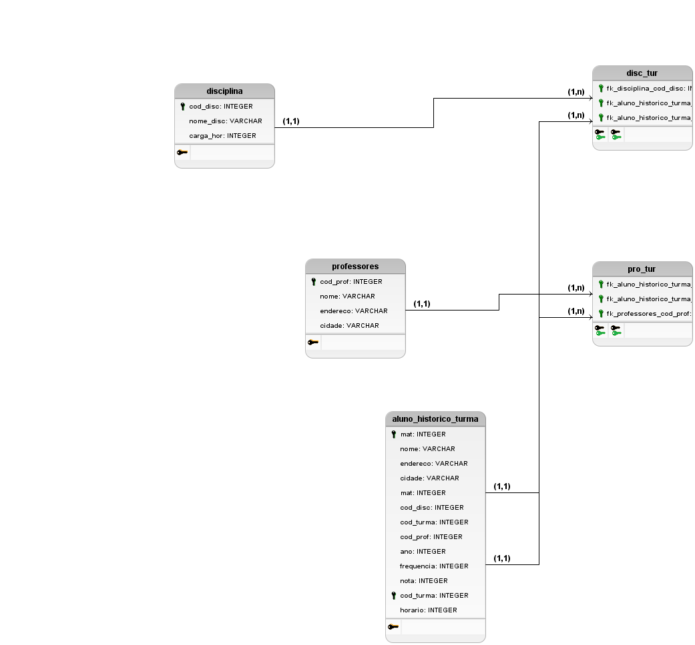

# Prova-Banco-de-Dados
trabalhando na prova de banco de dados para tirar pelomenos um 6,0 na nota.

# Mapa-Logico

# Explicação
**Prof_Tur= junção de professorres e turma, a ligação de uma a outra.**
**Disc_Tur= todas as turmas tem diciplinas com os professores.**
